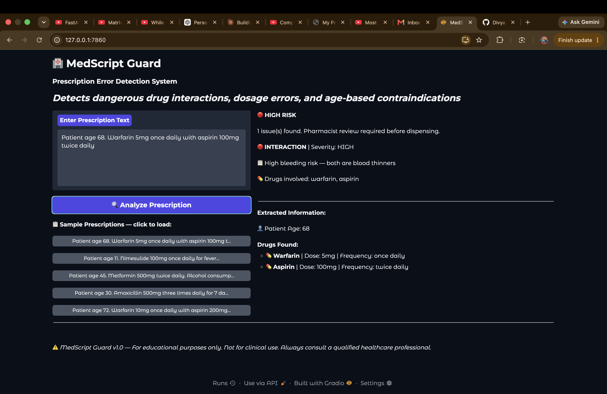
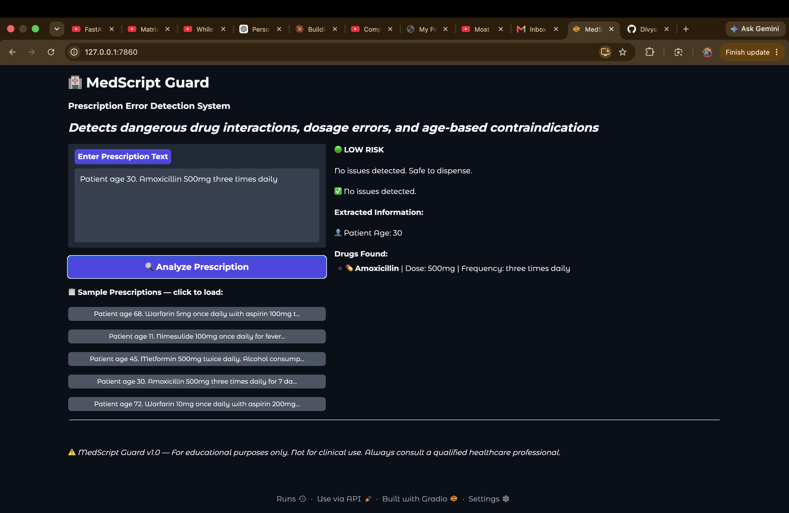

# 🏥 MedScript Guard

A prescription error detection system that identifies dangerous drug 
interactions, dosage errors, and age-based contraindications from 
free-text prescription input.

## What It Does

- Detects dangerous drug-drug interactions (e.g. Warfarin + Aspirin)
- Flags dosages outside safe therapeutic ranges
- Catches age-based contraindications (e.g. Nimesulide banned under 
  12 in India per CDSCO ruling, Aspirin avoided under 16 - Reye syndrome)
- Supports Indian brand names (Dolo, Crocin, Disprin, Ecosprin, 
  Combiflam, Pan)
- Supports Indian prescription shorthand (OD, BD, TDS, SOS)

## Pipeline Architecture

Each stage is independently tested. 20/20 tests passing.

## Quick Start

```bash
# Terminal 1 — API server
source .venv/bin/activate
uvicorn api.main:app --reload --port 8000

# Terminal 2 — Gradio interface  
source .venv/bin/activate
python dashboard/gradio_app.py
```

Open http://127.0.0.1:7860

## Sample Test Cases

| Prescription | Expected Result |
|---|---|
| Patient age 68. Warfarin 5mg OD with aspirin 100mg BD | HIGH — Interaction |
| Patient age 11. Nimesulide 100mg OD | HIGH — Age contraindication |
| Patient age 8. Disprin 100mg | HIGH — Age contraindication (Reye) |
| Patient age 45. Metformin 500mg BD. Alcohol reported | HIGH — Interaction |
| Patient age 30. Amoxicillin 500mg TDS | LOW — Safe |
| Patient age 68. Dolo 650mg BD | LOW — Safe |

## Tech Stack

- **NLP Pipeline:** Python, Regex-based NER, Rule engine
- **API:** FastAPI + Uvicorn
- **Interface:** Gradio
- **Tracking:** MLflow
- **Tests:** Pytest (20 tests)

## Known Limitations

- Drug list covers ~80 drugs. Rare drugs not detected.
- NER is rule-based, not a trained model. A fine-tuned 
  ClinicalBERT on i2b2 dataset would handle edge cases better.
- Dosage linking by index order — may mislink in complex 
  multi-drug prescriptions.

## Disclaimer

For educational purposes only. Not for clinical use.
Always consult a qualified healthcare professional.
# medscript-guard

## Screenshots

### HIGH RISK — Drug Interaction Detected


### LOW RISK — No Issues Detected


## Evaluation Results

Tested against 20 real-world Indian prescription scenarios.

| Category | Tests | Passed | Notes |
|---|---|---|---|
| Drug Interactions | 6 | 6 | Warfarin+Aspirin, SSRI+Tramadol, NSAIDs, Clopidogrel+PPI |
| Age Contraindications | 5 | 5 | Nimesulide <12, Aspirin <16 (Disprin, Ecosprin) |
| Dosage Errors | 4 | 4 | Aspirin, Paracetamol, Ibuprofen, Warfarin |
| Safe Prescriptions | 3 | 3 | Amoxicillin, Metformin, Crocin correctly cleared |
| Brand Name Mapping | 2 | 2 | Dolo→Paracetamol, Disprin→Aspirin |

**Total: 40/40 tests passing (20 core + 20 Indian prescription tests)**

### What the system catches
- Dangerous drug pairs (25+ interaction rules)
- Dosages outside safe therapeutic range (20 drugs)
- Age-based contraindications including Indian CDSCO rulings
- Indian brand names (Dolo, Crocin, Disprin, Ecosprin, Combiflam)
- Indian prescription shorthand (OD, BD, TDS, SOS, PRN)

### Known limitations
- Drug list covers ~80 drugs — rare drugs not detected
- Dosage ranges are adult ranges — pediatric weight-based dosing not implemented
- NER is rule-based — a fine-tuned ClinicalBERT on i2b2 would handle edge cases
- Does not handle handwritten or OCR prescription input
